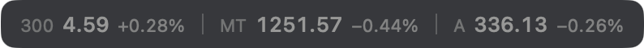
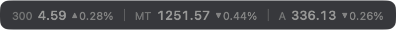
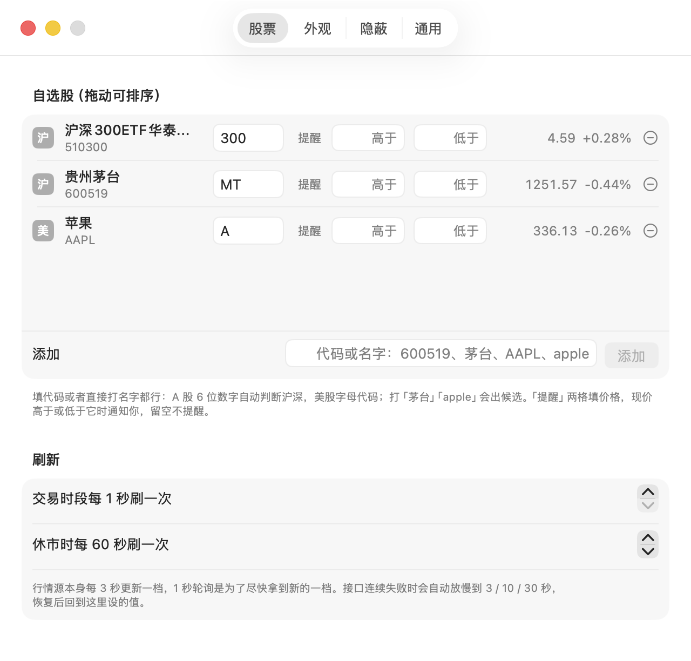
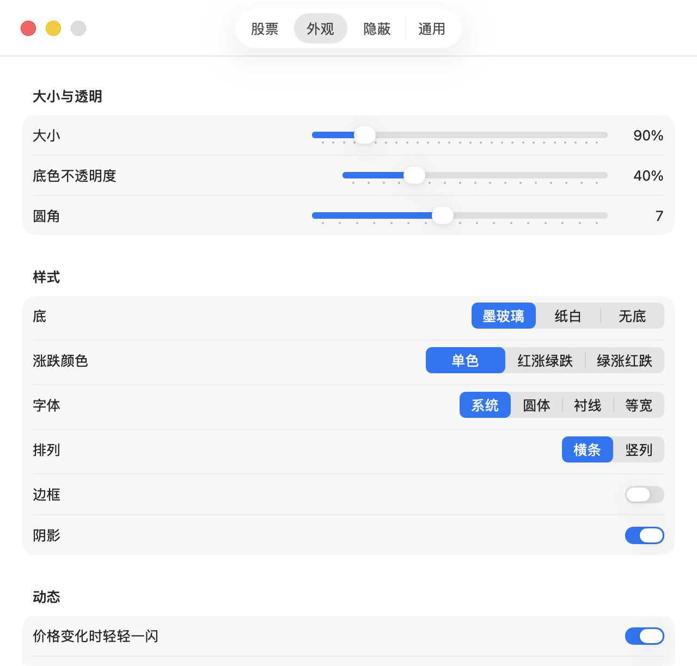
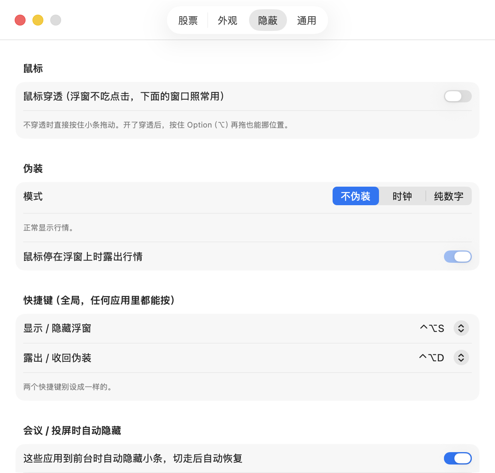

# 小条

一个 macOS 菜单栏小应用。在桌面上用一条置顶、半透明、不抢焦点的小条，实时显示你自选的 A 股和美股价格与涨跌幅。它的设计目标是**不显眼**：像一条系统 HUD，而不是行情软件。

<p align="center"></p>

## 为什么做它

上班时想瞄一眼几只股票，又不想开一个行情软件占着屏幕、被人一眼看出来。小条只占屏幕角落一小块，盖在所有窗口和全屏应用之上，随手拖到任何位置，鼠标可以穿透它，一个快捷键就藏起来，还能伪装成时钟或一串数字。

## 功能

**显示**
- 每只股票一段：代号（或真名，或不显示）、现价、涨跌幅。涨跌标记可选 ▲▼ 箭头、+ − 正负号或不标。
- 默认单色，最安静；也可切红涨绿跌（A 股习惯）或绿涨红跌（美股习惯），颜色是压低饱和度的朱砂和松绿。
- 大小 70%～200%、底色不透明度、圆角、边框、阴影；底可选墨玻璃 / 纸白 / 无底；字体系统 / 圆体 / 衬线 / 等宽；横条或竖列。
- 价格变化时数字轻轻一闪；休市的市场自动变暗；数据许久没更新时出现一个小空心点。

<p align="center"> <br></p>

**隐蔽**
- **一键隐藏**：全局快捷键 ⌃⌥S（可换），任何应用里都能按。
- **鼠标穿透**：开了之后点它点不到，下面的窗口照常用；按住 Option 再拖仍能挪位置。
- **伪装**：时钟模式只显示时间和星期，鼠标停上去或按 ⌃⌥D 才露出行情；纯数字模式去掉名字、箭头、百分号，只剩一串数。
- **会议 / 投屏时自动隐藏**：腾讯会议、Zoom、飞书会议、Keynote、Teams 到前台时自动藏起来，切走自动恢复。名单可改。

<p align="center"> &nbsp;&nbsp; </p>

**用起来**
- 添加股票直接打名字：输「茅台」「apple」出候选，点一下加入；填代码也行，6 位数字自动判断沪深。
- 每只可设价格提醒：现价高于或低于某个价时，系统通知一下，小条上那只亮一下。
- 鼠标停在某只上浮出昨收、今开、最高最低、行情时间；点一下打开它的行情页；右键直接出菜单。
- 交易时段每 1 秒刷新，休市和隐藏时放慢；接口失败自动退避，恢复后回到设定值。

<p align="center"></p>
<p align="center"></p>
<p align="center"></p>

## 安装

到 [Releases](https://github.com/Kris8888888/xiaotiao/releases/latest) 下载 `Xiaotiao-x.x.dmg`，打开后把「小条」拖进「应用程序」。

第一次打开请 **右键点应用 → 打开**（不要双击）。系统会说「无法验证开发者」，再点一次「打开」，之后就能正常双击了。如果只有「移到废纸篓」按钮，先点「完成」，再到「系统设置 → 隐私与安全性」页面底部点「仍要打开」。这是因为应用没有付费的开发者证书签名。

打开后菜单栏右上角多一个小横条图标，桌面右上角出现浮窗。它不占 Dock。

## 需要什么

- macOS 13 或更新，Apple 芯片和 Intel 都可以。
- 能上网。不需要任何账号。

## 数据来源与限制

- 行情来自腾讯与东方财富的公开接口，直连不走系统代理。
- A 股是交易所 Level-1 快照，源头每 3 秒更新一档，这是免费数据的上限；1 秒轮询只是为了尽快拿到新的一档。
- 美股盘中基本实时，盘前盘后停在收盘价。
- 暂不支持港股（免费源延迟 15 分钟）。
- 不含 K 线、盈亏、新闻、交易。

## 使用说明

完整操作说明见 [使用说明.md](使用说明.md)。设计思路和每一版改动见 [docs/](docs/)。

## 从源码编译

只需要 macOS 自带的命令行开发工具（Command Line Tools），不需要 Xcode。

```bash
cd App
./build.sh
```

产物在 `App/build/`：通用二进制（arm64 + x86_64）的 `.app`、`.zip` 和 `.dmg`。图标由 `tools/MakeIcon.swift` 在编译时生成。

演示模式（用默认示例股票，不动你的设置）：

```bash
XIAOTIAO_DEMO_SYMBOLS=1 App/build/小条.app/Contents/MacOS/Xiaotiao
```

## 项目结构

```
App/
  Sources/
    App.swift          应用入口
    AppState.swift     调度、菜单栏、快捷键、悬停、提醒、自动隐藏
    Models.swift       股票、行情、设置、外观枚举
    QuoteService.swift 腾讯 / 东方财富行情，按名字搜索
    Market.swift       交易时段
    Overlay.swift      置顶浮窗与三态渲染
    HotKey.swift       Carbon 全局快捷键
    SettingsView.swift 设置四页
  Resources/Info.plist
  tools/               图标生成、窗口截图辅助
  build.sh
docs/                  设计说明、截图
使用说明.md
```

## 技术说明

- Swift + SwiftUI，浮窗是 AppKit 的 `NSPanel`：`.statusBar` 层级、跨所有桌面空间、盖全屏应用、不激活不抢焦点；穿透靠 `ignoresMouseEvents`，穿透时的悬停和 Option 拖动靠全局鼠标事件监听。
- 全局快捷键用 Carbon `RegisterEventHotKey`，不需要辅助功能权限。
- 三种显示状态（行情、时钟、纯数字）共用同一套边距和字号，切换不变形。
- 设置用兼容式解码，升级版本不会重置已有配置。

## 许可

MIT
